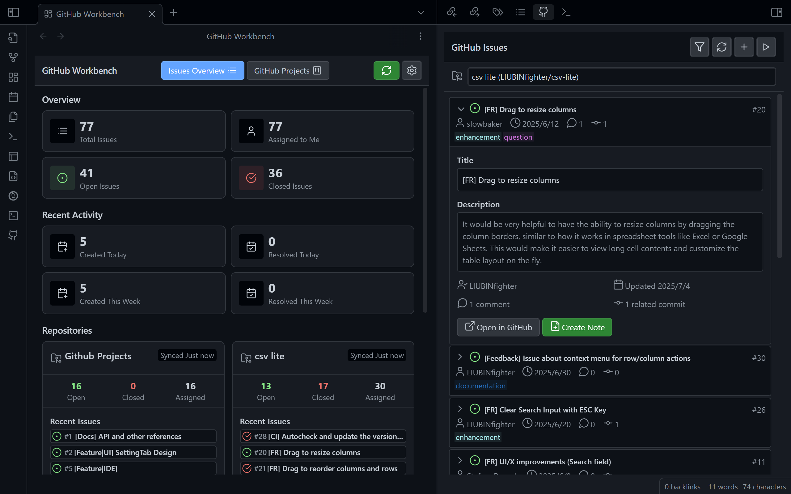

# Obsidian GitHub Projects

在 Obsidian 工作区内直接管理和查看 GitHub Issues 与项目。跳转到你的 IDE。从主视图工作台获取当前进度。

> 关于截图：上图展示了本插件的 beta 愿景，包括主工作台视图。首个版本重点提供强大的侧边栏功能（如右侧所示）。工作台及其他功能已在开发中（分支：dev），即将推出！

## 路线图

| 模块 / 功能              |      **拉取** *(查看 & 获取)*                                      |  **跳转** *(导航)*                                           |                                  **推送** *(创建/编辑)*                                   |   **关联** *(笔记集成)*                                      |
| ------------------------ | :--------------------------------------------------------------------: | :-----------------------------------------------------------------: | :--------------------------------------------------------------------------------------------: | :---------------------------------------------------------------------: |
| **UI / UX & 核心**       |    🚀 **仪表盘工作台** 🚀 **现代卡片布局**             |  🚀 **标签页导航** ✅ **统一头部栏**                  |                  🚧🤔 **主题/外观自定义** 🚧🤔 拖拽操作                   |                                    -                                    |
| **Issues**               | ✅ 获取 & 查看 Issues ✅ 筛选、展开、同步 🚀 跨仓库统计 | ✅ 跳转到 GitHub Issue 🚀 **通过命令在 IDE 打开仓库**       | 🚧 创建新 Issue 🚧 评论、关闭、编辑 Issue  🚧（类 vscode 开发体验） | 🚀 **从 Issue 创建笔记（按钮已存在）** 🚧🤔 关联已有笔记 |
| **Projects**             |             🚀🤔 **获取 & 查看项目（仓库/组织/用户）**             |                 🚀 **跳转到 GitHub 项目看板**                 |                   🚧 创建/编辑项目项 🚧 移动项目项状态                    |                        🚧🤔 关联项目到笔记                        |
| **工作台**            |         🚀 多仓库/项目聚合 🚀🤔 全局统计         |                      🚀 快速跳转到设置                       |                                  🚧🤔 自定义工作台布局                                  |    🚧🤔 在笔记中嵌入统计块（如 `wakatime` 或 `dataview.js`）    |
| **设置页**         |       ✅ 仓库配置  ✅ 令牌测试 🚀 项目管理        |                    🚀 项目/IDE 命令配置                    |                                               -                                                |                                    -                                    |

**图例：** ✅ = 已完成 🚀 = 开发中/Beta 🚧 = 计划中 🤔 = 征集想法

> 开发者可切换到 `dev` 分支查看开发进展。更多想法和讨论见 Issues！

## 快速开始

1.  从 Obsidian 社区插件商店安装本插件。
2.  进入 `设置` -> `社区插件` 并启用 "GitHub Projects"。
3.  打开插件设置（`设置` -> `GitHub Projects`）。
4.  **令牌设置**：切换到“令牌设置”标签页。创建一个新的 GitHub 个人访问令牌，授予 `repo` 权限（私有仓库）或 `public_repo`（仅公共仓库）。粘贴到输入框并点击“测试令牌”验证。
5.  **添加仓库**：切换到“仓库”标签页。通过仓库 URL 或手动输入 owner 和仓库名添加你要管理的仓库。
6.  **配置同步（可选）**：在“同步选项”标签页可启用自动同步并设置间隔。
7.  **开始管理**：点击侧边栏的 GitHub 图标或使用 "GitHub Projects: Open Issues View" 命令打开 Issues 面板，开始管理你的项目！

## 功能特性

- **便捷设置**：引导式设置页，支持 GitHub 令牌、仓库和同步选项配置，并带令牌验证功能。
- **专注 Issues 视图**：专用侧边栏浏览 GitHub Issues，支持强大筛选（标题、状态、标签等）和一键刷新。
- **快速访问**：可通过侧边栏图标或命令面板快速打开视图。
- **智能同步**：支持自动和手动同步，部分 Issue 可显示相关提交数。

## 设计理念

本插件基于以下核心原则：

- **远端为唯一真相**：GitHub 是唯一数据源，本插件提供增强视窗，而非本地镜像。
- **本地增强**：聚焦将项目管理与知识库连接，让 Obsidian 成为开发流程的高效起点。
- **专注操作**：插件帮助你查看 Issues、将其关联到笔记并转化为新笔记，不做 GitHub 与 Obsidian Markdown 内容的双向同步。

此外，目标体验类似于 [vscode-pull-request-github](https://github.com/microsoft/vscode-pull-request-github) 扩展。

## 愿景

无缝衔接创意与执行。我们相信，Obsidian 中捕捉的好点子应能顺畅转化为可追踪的开发任务。本插件旨在让 Obsidian 成为任何以 Issue 驱动开发风格的最高效入口。

## 灵感来源

-   [Githobs](https://github.com/GabAlpha/obsidian-githobs)
-   [vscode-pull-request-github](https://github.com/microsoft/vscode-pull-request-github)

## 许可证

本项目采用 Mozilla Public License 2.0 (MPL-2.0) 许可。详见 LICENSE 文件。

<!--## 愿景（已过时）

我希望如何使用这个插件？

“在 Obsidian 工作区中，将一个想法细化为带验收标准的任务笔记并一键创建为 GitHub Issue；随后在 VS Code 中，从 Issue 创建分支，编写失败测试，然后调用 MCP 服务自动打包 Issue 描述、相关 ADR 和代码，驱动 Copilot 高效编码直至测试通过。最后，在 VS Code 内完成 PR 创建、自查和 CI 触发，通过标准化发版脚本完成交付。”

本插件旨在高效桥接 Obsidian 与 GitHub。
-->
